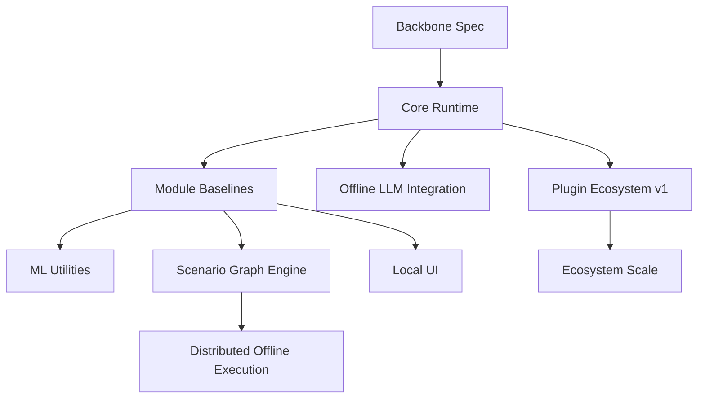

# ShellScribe Design Document (v0.1)

**Intent:** ShellScribe is an offline-first, library‑centric offensive security framework for **authorized** security testing and research. It focuses on modular orchestration, reproducibility, and safety‑by‑default while enabling advanced workflows through offline LLMs and optional ML utilities.

**Status:** Draft for design alignment and scope lock.

---

## 1) Goals

### Primary goals
- **Library‑first** architecture with a CLI reference client and optional local UI.
- **Offline by default** with **local LLM inference** (no data egress).
- **Event‑driven orchestration** with loose coupling between modules.
- **Pluggable ecosystem** (tools, modules, model runtimes, technique packs).
- **Reproducible runs** (event logs, deterministic seeds where possible).
- **Safety defaults** (policy gating, dry‑run, human‑in‑the‑loop).

### Non‑goals
- Not a turnkey “one‑click hack” system.
- Not a cloud SaaS.
- Not a replacement for professional judgment or engagement scoping.

---

## 2) Product Scope (MVP = “full system”)

The MVP includes **minimal but functional** versions of all major pillars:
- Orchestrator + Event Bus + Policy/Scope engine
- Offline LLM runtime adapters (llama.cpp + HF Transformers)
- Core modules: Recon, Fuzzing, Exploit Research Scaffold, Emulation/Scenario, Reporting
- Plugin manager
- Artifact + State storage (JSONL + SQLite)
- CLI reference client

MVP focuses on **end‑to‑end flow** with safety controls and reproducibility, rather than feature depth in each module.

---

## 3) Users & Use Cases

### Primary users
- Pen testers / red teamers (authorized engagements)
- Security researchers (lab environments)

### Representative use cases
- Run a scoped scenario in an offline lab and capture a full artifact trail.
- Execute a fuzzing job and triage findings via ML utilities.
- Generate exploit research scaffolding and structured notes for analysis.
- Produce a report bundle (findings + evidence + configs + replay log).

---

## 4) Core Requirements

### Functional requirements
- Task orchestration with policy gates at every action boundary.
- Modular pipeline with event‑based communication.
- Offline LLM support with configurable prompt pipelines.
- Artifact capture and replayable run logs.
- Plugin discovery and sandboxed execution (where feasible).

### Non‑functional requirements
- Offline‑capable and deterministic where possible.
- Cross‑platform: **Linux + macOS** first.
- Storage: **JSONL + SQLite** (human‑readable logs + structured queries).
- MIT license.

---

## 5) Architecture Overview

### Top‑level components
- **Orchestrator**: controls run loop, policy enforcement, state updates.
- **Event Bus**: async pub/sub for modules and core services.
- **Policy/Scope Engine**: validates tasks and tool invocations.
- **Artifact + State Store**: JSONL event logs + SQLite for state/indexing.
- **LLM Integration Layer**: runtime adapters + prompt pipelines.
- **ML Utilities**: optional triage/ranking/clustering.
- **Modules**: recon, fuzzing, scaffold, emulation, reporting, report ingestion/planning.
- **Plugin Manager**: dynamic extension system.

### 5.1 Target Profiles & Capability Routing

ShellScribe is designed to support **multiple target types** by normalizing inputs
into a common **Target Profile** and routing only **compatible modules**.

**Target types (first‑class)**
- **Codebase** (repo path)
- **Package/Library** (artifact bundle)
- **Website/Web App** (URL + optional test creds)
- **API** (OpenAPI spec or base URL)
- **Mobile App** (APK/IPA + emulator/device)
- **Network Service** (host/port + protocol hints)

**Target Descriptor (conceptual)**
```yaml
target:
  type: web_app | api | codebase | mobile | package | service
  scope:
    allowlist: [...]
    time_window: ...
  inputs:
    path: ...
    url: ...
    artifacts: ...
  credentials:
    provided_by_user: true
```

**Capability routing**
- Each module declares **supported target types** and **required inputs**.
- Orchestrator selects modules based on target profile + policy.
- Unsupported modules are skipped with an explicit log event.

**Example routing (high‑level)**
- **Codebase** → static analysis, dependency/SBOM, config posture, reporting
- **Package** → metadata + dependency review, SBOM, license checks, reporting
- **Web/API** → endpoint mapping, auth flow review, input robustness checks
- **Mobile** → manifest/permissions review, static inspection, reporting
- **Service** → metadata fingerprinting, stability checks (lab only)

### ANSI sketch (system view)

```text
                                     ┌──────────────────────────────┐
                                     │          ShellScribe          │
                                     │  Offline Offensive Framework  │
                                     └──────────────────────────────┘

  ┌──────────────────────────────────────────────────────────────────────────┐
  │  (Python)                      (shellscribe)                 (optional)  │
  └──────────────────────────────────────────────────────────────────────────┘
                       │                         │                      │
                       └───────────────┬─────────┴───────────┬──────────┘
                                       │                     │
  ┌──────────────────────────────────────────────────────────────────────────┐
  │                              Core Runtime                                │
  │  ┌────────────┐   ┌────────────┐   ┌─────────────┐   ┌─────────────────┐ │
  │  │Orchestrator│<->│  Event Bus │<->│ Policy/Scope│<->│  State + Store   │ │
  │  └────────────┘   └────────────┘   └─────────────┘   │ JSONL + SQLite   │ │
  │          │                 │               │         └─────────────────┘ │
  │          │                 │               │                   │         │
  └──────────┼─────────────────┼───────────────┼───────────────────┼─────────┘
             │                 │               │                   │
  ┌──────────▼─────────┐  ┌────▼─────┐   ┌──────▼─────┐      ┌─────▼─────────┐
  │  Modules           │  │  LLM     │   │   ML       │      │  Plugin       │
  │  - Recon           │  │ Adapter  │   │ Utilities  │      │  Manager      │
  │  - Fuzzing         │  │  - llama │   │ - triage   │      │ (entrypoints  │
  │  - Scaffold        │  │  - HF    │   │ - ranking  │      │ + manifests)  │
  │  - Emulation       │  │ Pipelines│   │ - cluster  │      │               │
  │  - Reporting       │  │          │   │            │      │               │
  │  - Report Ingest   │  │          │   │            │      │               │
  │  - Plan Synth      │  │          │   │            │      │               │
  └────────────────────┘  └──────────┘   └────────────┘      └───────────────┘
             │
             ▼
  ┌──────────────────────────────────────────────────────────────────────────┐
  │                              Artifacts                                    │
  │  Evidence bundles, repro inputs, logs, reports, generated outputs         │
  └──────────────────────────────────────────────────────────────────────────┘
```

---

## 6) Core Runtime

### Orchestrator
**Responsibilities**
- Owns run lifecycle and task scheduling.
- Enforces policy/scope.
- Updates state and triggers reporting.
- Supports replay of prior runs.

**Key interfaces (conceptual)**
- `submit_task(task: TaskSpec) -> TaskId`
- `subscribe(event_type, handler)`
- `get_state() -> StateSnapshot`
- `replay(run_id) -> Iterable[Event]`

### Event Bus
Decouples modules and core services via pub/sub events.  
Preferred implementation: in‑process async queue with structured event schemas.

### Policy / Scope Engine
Validates every action:
- allowed targets / ranges
- allowed action categories
- dry‑run vs execute
- rate limits / time windows

All tool calls must pass `policy.check(action)` before execution.

### State + Artifact Store
**State includes**
- Targets/assets/services (normalized)
- Findings and evidence references
- Task graph (attempts + outcomes)
- Model/tool metadata (versions, configs, seeds)

**Storage design**
- JSONL for event logs and replay (`runs/<id>/events.jsonl`)
- SQLite for indexed state and queries (`runs/<id>/state.db`)
- Artifact folder for evidence, inputs, generated outputs

---

## 7) LLM Integration

### Runtime adapters (offline)
- **llama.cpp** (GGUF) for local inference
- **HF Transformers** with offline weights
- Backends are pluggable via the plugin system

### Prompt pipelines
LLM usage is mediated by structured pipelines:
- **Planner**: propose next high‑level step
- **Translator**: map to structured tasks
- **Verifier**: validate outputs vs policy & sanity checks
- **Summarizer**: compress outputs into durable memory

### Report‑driven planning (LLM‑assisted)
ShellScribe can ingest a prior pentest report and produce a **policy‑gated** test plan:
- **Report Ingestion**: parse report into structured scope + findings + evidence map.
- **Gap Analyzer**: identify coverage gaps or ambiguous claims at a high level.
- **Plan Composer**: generate **high‑level tasks only** (no direct execution).
- **Policy Gate + Approvals**: every task must pass policy and explicit approval.

### Memory & context
- Short‑term context: last N events + current objective
- Long‑term memory: indexed summaries + structured facts
- Retrieval: keyword + optional vector search (offline only)

---

## 8) ML Utilities (Optional Layer)

Lightweight, optional ML utilities to reduce noise:
- Crash deduplication and clustering
- Finding ranking / prioritization
- Anomaly detection in telemetry

These emit events (e.g., `FindingClustered`, `FindingRanked`) and do not bypass policy gates.

---

## 9) Modules (Pluggable Capabilities)

All modules implement a consistent interface:
- `initialize(ctx)`
- `on_event(event)`
- `handle_task(task) -> Events[]`

### Recon
Normalizes discovery outputs:
- assets, ports, services, endpoints
- emits `AssetDiscovered`, `ServiceDiscovered`, `EndpointDiscovered`

### Fuzzing
Job‑oriented fuzzing pipeline:
- emits `FuzzJobStarted`, `CrashFound`, `ReproSaved`, `CoverageUpdated`

### Exploit Research Scaffold
Produces **non‑operational** research scaffolding:
- structured notes, PoC skeletons, environment reproduction templates
- emits `ExploitScaffoldGenerated`, `HypothesisCreated`

### Emulation / Scenario
Executes predefined technique graphs in authorized labs:
- emits `ScenarioStepStarted`, `ScenarioStepCompleted`, `ScenarioOutcome`

### Reporting
Generates reproducible outputs:
- Markdown reports, JSON exports, evidence bundles
- emits `ReportGenerated`

### Report Ingestion + Planning (Pentest‑focused)
Optional modules that enable “report‑driven pentest” workflows:
- **Report Ingestion**: normalize prior reports into structured data.
- **Gap/Delta Analyzer**: summarize what is missing or unclear.
- **Plan Synthesizer**: propose a policy‑gated test plan (high‑level only).
- **Evidence Consistency Checker**: ensure findings are backed by artifacts.
- **Report Composer**: generate new reports strictly from captured evidence.

### Report‑Driven Pentest Mode (LLM‑guided, evidence‑bound)
**Intent:** use the LLM to reason over prior reports, propose tests, and generate a new report,
while keeping execution deterministic and policy‑controlled.

**Workflow (high‑level)**
1. Ingest prior report → structured scope + findings.
2. Validate scope against allowlist + policy.
3. LLM proposes a **high‑level** test plan (tasks only).
4. Orchestrator gates tasks (policy + approvals).
5. Modules execute approved tasks and emit evidence.
6. Reporting composes a new report **only from artifacts**.

**Guardrails**
- No LLM‑initiated execution; all actions are policy‑gated.
- All claims in reports must reference captured artifacts.
- Offline‑only operation by default.

---

## 10) Plugin System

### Plugin types
- Tool wrappers
- Modules
- Prompt packs
- Model runtimes
- Technique packs

### Discovery & loading
- **Python entrypoints** for runtime discovery
- **Manifest** for metadata and policy constraints
- Optional sandboxing for risky plugins

### Capability tiers & plugin trust levels
To enable “aggressive” capability while keeping the core responsible and auditable,
ShellScribe uses **capability tiers** plus **plugin trust levels**.

**Capability tiers (policy‑gated)**
- **Tier 0 — Passive/Read‑only:** inventory, static analysis, reporting.
- **Tier 1 — Active/Safe:** controlled, non‑destructive checks and lab‑safe fuzzing.
- **Tier 2 — High‑risk/External:** user‑supplied plugins with explicit enablement and strict gates.

**Trust levels**
- **Core (first‑party):** maintained by ShellScribe; Tier 0 and Tier 1 only.
- **Verified (partner):** audited plugins with signed manifests.
- **Third‑party (user‑supplied):** allowed only with explicit enablement.

**Policy gates (examples)**
- Tier 0: allowlist + offline required.
- Tier 1: allowlist + approvals + rate limits + lab mode recommended.
- Tier 2: explicit enablement + approvals + lab mode + audit logging + signed scope.

**Note:** Tier 2 plugins are **not** distributed as first‑party modules.

---

## 11) Interfaces

### Library API (primary)
- `Orchestrator(config)`
- `run(scenario)`
- `submit_task(task)`
- `export_report(format="md")`

### CLI (reference client)
Binary: `shellscribe`

Example command shapes:
- `shellscribe project init`
- `shellscribe run scenario <name>`
- `shellscribe plugins list|enable|disable`
- `shellscribe replay <run_id>`
- `shellscribe report <run_id> --format md`

### Optional local UI (future)
Local dashboard on `localhost`:
- event timeline, task graph, findings, artifact browsing
- human‑in‑the‑loop approvals

---

## 12) Data Model (High‑Level)

### Core entities
- **Run**: id, config, timestamps, environment metadata
- **Task**: spec, status, policy context
- **Event**: typed payloads with strict schema
- **TargetProfile**: normalized target descriptor + scope inputs
- **Finding**: normalized evidence record
- **Artifact**: file reference with checksum

---

## 13) Safety & Controls

Default posture:
- **dry‑run enabled**
- **policy allowlist required**
- **human‑in‑the‑loop required for execution**
- offline mode (no network egress)

Additional controls:
- module resource limits (CPU/time/memory)
- artifact quarantine with checksums
- strict logging + redaction rules

---

## 14) Testing Strategy

### Unit tests
- policy engine
- event schema validation
- prompt pipeline contracts

### Integration tests
- deterministic lab scenarios
- replay tests (events → same state)

### Safety tests
- enforce no outbound network in offline mode
- sandbox escape checks (where feasible)

---

## 15) Packaging & Distribution

### Python
- `pipx` installable CLI
- library package published to PyPI (when ready)

### C++ Core
- optional native module for performance‑critical tasks
- Python bindings exposed via pybind11

---

## 16) Roadmap

### v0.1 (Design + Skeleton)
- core runtime interfaces and schemas
- minimal module stubs
- plugin manager scaffolding
- CLI skeleton

### v0.2 (End‑to‑End MVP)
- working run loop
- artifacts + replay
- minimal recon/fuzz/report flow

### v0.3+ (Depth & Extensions)
- richer module capabilities
- ML triage and ranking
- scenario packs + UI prototype

---

## 17) Complexity Roadmap (Milestones, Risks, Dependencies)

### 17.1 Complexity strategy
- **Keep the spine stable:** Orchestrator, Event Bus, Policy, Storage, and core schemas must remain backward‑compatible.
- **Add complexity as layers:** LLMs, ML utilities, scenario graphs, UI, and distributed execution are strictly additive.
- **Gate new layers by acceptance criteria:** No new layer ships without tests, replay stability, and policy compliance.

### 17.2 Milestone layers (huge‑system path)

**M0 — Backbone spec lock**
- Scope: event schemas, task schema, policy interface, storage layout, plugin contract v1.
- Exit criteria: published spec docs + JSON schema validation; replay passes on toy runs.

**M1 — Core runtime**
- Scope: orchestrator loop, event bus, policy gate, JSONL + SQLite store, CLI skeleton.
- Dependencies: M0.
- Exit criteria: deterministic replay + artifact capture + policy deny/allow tests.

**M2 — Plugin ecosystem v1**
- Scope: Python entrypoints + manifest format + loader.
- Dependencies: M1.
- Exit criteria: plugin isolation checks + compatibility validation.

**M3 — Offline LLM integration**
- Scope: llama.cpp + HF runtime adapters; prompt pipeline contracts.
- Dependencies: M1.
- Exit criteria: offline verification, context/memory tests, policy‑aware verifier.

**M4 — Module baselines**
- Scope: recon, fuzzing, scaffold, emulation, reporting (minimal but end‑to‑end).
- Dependencies: M1 + M2.
- Exit criteria: e2e run produces findings + report + replay.

**M5 — ML utilities**
- Scope: clustering/ranking/triage with event outputs.
- Dependencies: M4.
- Exit criteria: measurable noise reduction on sample datasets.

**M6 — Scenario graph engine**
- Scope: technique graphs, checkpoints, replayable scenarios.
- Dependencies: M4.
- Exit criteria: scenario execution determinism + policy audit trail.

**M7 — Local UI + review workflow**
- Scope: timeline, task graph, approvals, artifact viewer.
- Dependencies: M1 + M4.
- Exit criteria: UI uses the same APIs and does not bypass policy.

**M8 — Distributed offline execution**
- Scope: local agent pool, work queue, shared artifact store.
- Dependencies: M1 + M4 + M6.
- Exit criteria: deterministic replay across nodes + offline isolation tests.

**M9 — Ecosystem scale**
- Scope: plugin registry (local index), versioning policy, governance docs.
- Dependencies: M2 + M4.
- Exit criteria: compatibility tooling + security review checklist.

### 17.3 Dependency graph (conceptual)



### 17.3.1 ANSI sketch (dependency view)

```text
                   ShellScribe Complexity Dependency Graph

                      [M0 Backbone Spec]
                               |
                               v
                        [M1 Core Runtime]
                         /       |       \
                        v        v        v
           [M2 Plugin Ecosystem] [M3 Offline LLM] [M4 Module Baselines]
                    |                              |        |
                    v                              v        v
           [M9 Ecosystem Scale]           [M5 ML Utilities] [M6 Scenario Graph]
                                                       |            |
                                                       v            v
                                              [M7 Local UI]     [M8 Distributed]
```

### 17.4 Risk register (big‑system risks)
- **Scope creep** → Freeze interfaces early; enforce versioning and deprecation policy.
- **Policy bypass** → Centralize checks in orchestrator; audit all tool adapters.
- **Non‑deterministic runs** → Record seeds, versions, configs; enforce replay testing in CI.
- **Plugin supply‑chain risk** → Signed manifests, allowlist, sandboxing, and review checklist.
- **Performance debt** → Identify hot paths and move to C++ core with clear boundaries.
- **UI drift** → UI must be a client of the same APIs; no hidden backdoors.

---

## 18) Decisions & Open Questions

### Decisions (current)
- **Report formats (phase 1):** Markdown + JSON.
- **Lab mode defaults:** approvals optional; dry‑run OFF; allowlist + offline still enforced; any online intel sync must be explicit and logged.
- **Findings schema:** baseline required fields (id/title/severity/confidence/targets/evidence refs/provenance/timestamps) plus extensible metadata for deep detail.
- **C++ core:** required (not optional at build time).
- **First‑party plugin boundary:** Tier 0 and Tier 1 only; high‑risk plugins are third‑party with explicit enablement and strict gates.

### Open Questions
- Which tools are allowed as first‑party plugins?

---

## 19) Appendix: Suggested Repo Layout

```
shellscribe/
  src/shellscribe/
    core/
    llm/
    ml/
    modules/
    plugins/
  cli/
  examples/
  docs/
  tests/
```
