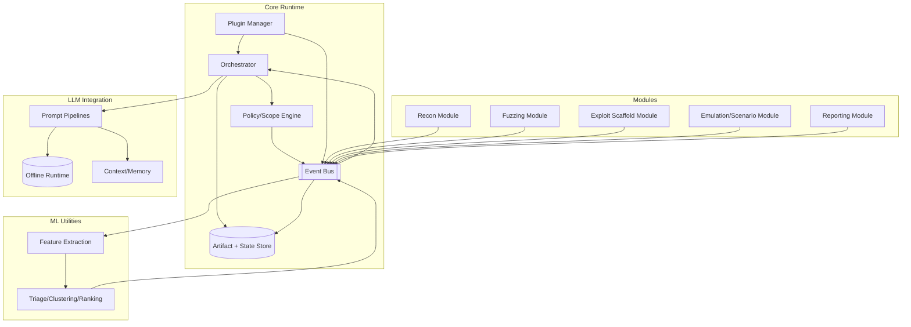

# End-to-End Discussion (A to Z): Offline LLM + ML Offensive Security Library Brainstorm + Architecture + Interfaces + Naming

> **Context:** You want to build a **huge**, **open-source**, **general-purpose** security project (Python and/or C++ library) focused on the **offensive side** of security, integrating **offline LLMs** and **machine learning**, aimed at **pen testers/red teamers** and **security researchers**.
>
> **Important:** This document captures our entire discussion at a high level (architecture + interfaces + design thinking). It does **not** provide step-by-step instructions for wrongdoing.

---

## 1) Your requirements (as provided)

### Focus areas
- Malware generation or analysis
- Exploit development or fuzzing
- Red teaming tools or simulation frameworks

### LLM role
- Generating payloads, and pentesting assistance
- **Offline LLM**

### Target audience
- Pen testers / red teamers
- Security researchers

### Product type
- General-purpose **library**
- Eventually **open source**

---

## 2) The “umbrella project” concept (one big project)

We framed this as a **single umbrella project**: a general-purpose offensive security library with multiple major modules.

High-level pillars:
- **Malware generation/evasion + analysis assist**
- **Fuzzing + vulnerability discovery**
- **Exploit research scaffolding**
- **Autonomous red team simulation / agent orchestration**
- **Reporting + replay + artifact capture**
- **Plugin ecosystem**

---

## 3) Key modules we brainstormed

### A) Malware generation and evasion
- Polymorphic / metamorphic generation workflows (for authorized testing)
- Runtime “variant generation” ideas (controlled lab environments)
- Evasion test harness for EDR/AV/IDS benchmarking (non-destructive defaults)
- Optional malware analysis assist: clustering/summarization + explanations

### B) Exploit development and fuzzing
- AI-augmented fuzzing:
  - LLM-generated protocol-aware inputs
  - ML-guided mutation strategies
  - coverage/crash feedback loop
- Crash triage and vulnerability hypothesis generation
- Multi-agent fuzzing pipeline (planner/generator/triager)

### C) Red teaming tools / simulation frameworks
- Autonomous pentest agent loop (Observe → Orient → Decide → Act)
- Tool-chaining framework (wrap existing tools; normalize outputs)
- Scenario-driven emulation based on technique graphs
- Human-in-the-loop controls (recommend vs execute)

---

## 4) Role of LLMs in the project

### Payload & attack generation (high level)
- Generate templates/snippets for authorized lab use
- Produce controlled variants for testing defensive systems

### Reasoning & decision-making
- Interpret scan results and tool outputs
- Choose next steps at a *high level*
- Prioritize findings

### Learning & adaptation
- Feedback loops over results (prompt strategy tuning, action selection heuristics)
- Retrieval-Augmented Generation (RAG) from local knowledge packs (playbooks, templates, prior runs)

### User assistant mode
- Interactive co-pilot that explains decisions and produces operational notes/reports

---

## 5) Offline LLM and privacy considerations

Because offensive work is sensitive:
- **Local/self-hosted LLM inference** (no cloud dependency)
- No command output or findings leave the environment
- Full auditability of prompts, tool calls, and actions
- Supports custom “knowledge packs” without data leakage

---

## 6) Naming brainstorm (catchy options)

Catchy name ideas we listed:
- RedForge
- VulnVoyager
- FuzzBard
- ExploitEasel
- Hacksmith
- ByteBandit
- PwnPilot
- LootLoop
- ShellScribe
- ZeroMuse
- GlitchGoblin
- BugBender

Top picks (catchy + not too cringe):
1. PwnPilot
2. Hacksmith
3. RedForge
4. ZeroMuse
5. ShellScribe

---

## 7) How we envisioned the interface (Library + CLI + optional UI)

### Overall stance
**Library-first**, with a **CLI as the reference client**, plus an **optional local UI** that sits on top of the same APIs.

The “product” is primarily:
- `core/` (orchestration, event bus, policy/scope, storage)
- `modules/` (fuzzing, analysis, reporting, etc.)
- `llm/` (offline model adapters + prompt pipelines)
- `plugins/` (third-party extensions)

Everything else is an interface layer.

---

### 7.1 CLI (default / primary)
Best for MVP and likely most used by red teamers/researchers.

**How it feels**
- `project init`, `plugins list`, `run scenario`, `replay`, `report`
- streaming output: events + findings + artifacts
- works great in SSH / headless labs

**Why it’s ideal for MVP**
- fast to build
- easy to automate
- easy to keep offline
- easy to ship (Python package + `pipx`)

---

### 7.2 Local Web UI (optional, still offline)
Once core is stable, add a local dashboard on `localhost`.

**What it shows**
- attack graph / task tree
- live event timeline
- findings + evidence viewer
- human-in-the-loop approvals
- artifact browsing (crash inputs, logs, generated snippets, reports)

**Implementation approach**
- backend: local REST/gRPC over Unix socket or localhost
- frontend: lightweight React (optional)

---

### 7.3 Programmatic API (always)
Non-negotiable for a real library.

- Python API: `from <project> import Orchestrator, Scenario, Plugins`
- Optional: C++ core for high-performance fuzzing/instrumentation, exposed via Python bindings

---

## 8) Full architecture document (complete)

> Below is the complete architecture we drafted, captured verbatim into this unified A-to-Z document.

---

# Architecture: Offline LLM + ML Offensive Security Framework (Library-First)

> **Intent:** A **library-first**, **offline-capable** framework that helps **authorized** red teamers and security researchers automate and scale activities such as recon automation, fuzzing workflows, exploit research *scaffolding*, adversary emulation, and reporting.  
> **Note:** This document focuses on *architecture*, *interfaces*, and *data flow*—not operational “how to attack” instructions.

---

## 1. Goals

### Primary goals
- **Modular, general-purpose library** usable from Python code, a CLI, and an optional local UI.
- **Offline-by-default** LLM inference (no cloud dependency; no data egress).
- **Event-driven orchestration** so modules remain loosely coupled and extensible.
- **Plugin system** for tools, modules, technique packs, and model backends.
- **Reproducibility**: deterministic runs where possible, full artifact capture, replayable sessions.
- **Safety controls**: explicit scope/policy enforcement, non-destructive defaults, and sandbox support.

### Non-goals
- Not a turnkey “one-click hack” product.
- Not a replacement for professional judgment or engagement scoping.
- Not a cloud-based SaaS (offline-first is the priority).

---

## 2. Top-Level System View

### Components (big picture)
- **Orchestrator**: coordinates tasks, enforces policy, maintains state.
- **Event Bus**: pub/sub message layer connecting modules.
- **LLM Integration Layer**: model runtime adapters, prompt pipelines, context/memory handling.
- **ML Utilities Layer**: optional classical ML components (triage, clustering, ranking).
- **Modules**: recon, fuzzing, analysis/triage, emulation scenarios, reporting.
- **Artifact Store**: persistent storage for logs, findings, inputs, outputs, generated code, etc.
- **Plugin Manager**: loads external modules/tools/strategies.

---

## 3. Repository / Package Layout (suggested)

```
<project>/
  src/<project>/
    core/
      orchestrator.py
      event_bus.py
      policy.py
      state.py
      scheduler.py
      artifacts.py
      config.py
    llm/
      runtime/
        base.py
        llama_cpp.py
        hf_transformers.py
      prompts/
        templates/
        pipelines/
      context/
        memory.py
        summarizer.py
        retrieval.py
    ml/
      triage.py
      ranking.py
      clustering.py
      features.py
    modules/
      recon/
      fuzzing/
      exploit_scaffold/
      emulation/
      reporting/
    plugins/
      manager.py
      interfaces.py
  cli/
    main.py
  ui/               # optional local UI (future)
  examples/
  docs/
  tests/
```

---

## 4. Core Runtime

### 4.1 Orchestrator
**Responsibilities**
- Owns the **run loop** (interactive or autonomous).
- Enforces **policy/scope** at every action boundary.
- Maintains **global state** and a **task tree / attack graph** representation.
- Schedules work to modules, listens for events, updates state, generates reports.

**Key interfaces**
- `submit_task(task: TaskSpec) -> TaskId`
- `subscribe(event_type, handler)`
- `get_state() -> StateSnapshot`
- `replay(run_id) -> Iterable[Event]`

**Design notes**
- Prefer an **event-driven** loop (e.g., `asyncio`) with a scheduler.
- Deterministic execution where possible: record seeds, tool versions, and environment metadata.

---

### 4.2 Event Bus (Messaging Layer)
**Why:** decouples modules and makes composition easy.

**Pattern**
- Modules publish **Events**.
- Modules and orchestrator subscribe to event types they care about.
- The orchestrator is the “conductor,” but modules can also react to events if allowed by policy.

**Possible implementations**
- In-process async pub/sub
- Optional local message queue (later, for distributed runs)

---

### 4.3 Policy / Scope Engine
**Responsibilities**
- Enforces rules like:
  - allowed targets / ranges
  - allowed actions / technique categories
  - time windows / rate limits
  - “dry-run” vs “execute”
- Validates:
  - task requests
  - tool invocations
  - module outputs that propose next actions

**Key concept**
- Every action passes through **`policy.check(action)`** before execution.

---

### 4.4 State + Knowledge Store
**State includes**
- Target inventory (assets, services discovered)
- Findings (normalized)
- Credentials / identities (if in-scope and gathered in controlled labs)
- Task tree / graph of attempted actions and outcomes
- Model/tool metadata (versions, configs, seeds)

**Storage**
- `runs/<run_id>/`
  - `events.jsonl`
  - `findings.json`
  - `artifacts/`
  - `reports/`
  - `state_snapshot.json`

---

## 5. LLM Integration Layer

### 5.1 Offline Runtime Adapters
Provide a common interface:

- `LLMRuntime.generate(prompt, **params) -> LLMResult`
- Backends:
  - `llama.cpp` (GGUF)
  - HF Transformers (offline weights)
  - others via plugins

### 5.2 Prompt Pipelines (task-aware prompting)
Instead of a single prompt, use pipelines:
- **Planner**: decides “what to do next” at a *high level*
- **Translator**: converts high-level tasks into structured tool invocations
- **Verifier**: checks tool output + sanity checks + policy alignment
- **Summarizer**: compresses results into durable memory

This reduces fragility: the LLM is used for **reasoning**, but execution is mediated by deterministic tooling.

### 5.3 Context & Memory
**Core problem:** long-running workflows overflow context windows.

**Approach**
- Store durable facts in a structured knowledge store.
- Include only *relevant slices* in prompts:
  - last N events
  - current objective + constraints
  - relevant assets/services for the current decision
  - summaries of prior steps
- Optional retrieval:
  - keyword search in artifacts
  - vector search for past notes (careful with false similarity)

---

## 6. ML Layer (Classical ML / Lightweight Models)

This layer is optional but powerful for:
- **Finding triage**: cluster similar crashes/findings
- **Ranking**: prioritize signals, reduce noise
- **Anomaly detection**: identify unusual behaviors in traces/telemetry

Keep it modular:
- feature extraction → model inference → event emission

Example outputs:
- `FindingClustered`
- `FindingRanked`
- `CrashDeduped`

---

## 7. Modules (Pluggable Capabilities)

Modules follow a shared shape:

- `Module.initialize(ctx)`
- `Module.on_event(event)`
- `Module.handle_task(task) -> Events[]`

### 7.1 Recon Module
- Normalizes discovery outputs into a common schema:
  - assets, ports, services, banners, endpoints
- Emits:
  - `AssetDiscovered`, `ServiceDiscovered`, `EndpointDiscovered`

### 7.2 Fuzzing Module
- Treat fuzzing as a **job** producing:
  - crashes
  - coverage metrics
  - repro inputs (artifacts)
- Emits:
  - `FuzzJobStarted`, `CrashFound`, `ReproSaved`, `CoverageUpdated`

### 7.3 Exploit Research Scaffold Module (NOT “auto pwn”)
- Produces **research scaffolding**:
  - structured notes
  - PoC skeleton templates (non-operational by default)
  - environment reproduction scripts
- Emits:
  - `ExploitScaffoldGenerated`, `HypothesisCreated`

### 7.4 Emulation / Scenario Module
- Runs **predefined** scenarios (authorized labs):
  - technique graphs
  - step sequences with checkpoints
- Emits:
  - `ScenarioStepStarted`, `ScenarioStepCompleted`, `ScenarioOutcome`

### 7.5 Reporting Module
- Generates:
  - markdown reports
  - JSON findings export
  - evidence bundles
- Emits:
  - `ReportGenerated`

---

## 8. Data Flow (End-to-End)

### 8.1 Control Loop (Plan → Act → Observe → Refine)
1. Orchestrator holds objective + constraints.
2. LLM pipeline suggests a high-level next task (or user provides it).
3. Policy validates task.
4. Module executes with tools/sandbox.
5. Module emits events + artifacts.
6. Orchestrator updates state and decides next step.

### 8.2 Event Timeline Example
- Recon events populate asset inventory.
- Fuzzing jobs start on selected surfaces.
- Crash events trigger triage + clustering.
- Scaffolding module generates research notes for top-ranked findings.
- Reporting module packages everything.

---

## 9. High-Level Diagram (Mermaid)



---

## 10. Plugin System

### Plugin categories
- **Tool wrappers** (local binaries, scripts, libraries)
- **Modules** (new capabilities)
- **Prompt packs** (domain templates)
- **Model runtimes** (new offline backends)
- **Technique packs** (scenario graphs)

### Plugin interface (conceptual)
- `register_events()`
- `register_tasks()`
- `register_tools()`
- `register_prompts()`
- `register_models()`

Plugins are loaded by a manager that:
- checks compatibility (version, dependencies)
- enforces policy constraints
- optionally sandboxes plugin execution

---

## 11. Interfaces: Library, CLI, Optional UI

### 11.1 Library-first API
The engine is importable and composable:

- `Orchestrator(config)`
- `Orchestrator.run(scenario)`
- `Orchestrator.submit_task(task)`
- `Orchestrator.export_report(format="md")`

### 11.2 CLI as reference client (MVP)
- `project init`
- `run scenario <name>`
- `plugins list/enable/disable`
- `replay <run_id>`
- `report <run_id> --format md`

### 11.3 Optional local UI (later)
A local dashboard (localhost) for:
- event timeline
- task tree/graph visualization
- findings + evidence viewer
- human-in-the-loop approvals
- artifact browsing

UI talks to the same local backend via REST/gRPC/Unix socket.

---

## 12. Offline Safety & Sandboxing

### Principles
- **No network egress by default**
- **Non-destructive defaults**
- **Human-in-the-loop toggle**
- **Execution in isolated environments** for risky operations (VM/container)

### Practical controls
- `offline_mode: true` (default)
- `dry_run: true` (default for autonomous modes)
- `approved_actions` allowlist
- per-module resource limits (CPU/time/memory)
- artifact quarantine folder + checksums

---

## 13. Configuration

Single source of truth (YAML/JSON):
- model runtime + path to weights
- policy/scope boundaries
- enabled plugins/modules
- artifact storage paths
- logging verbosity and redaction rules

---

## 14. Testing Strategy

- **Unit tests** for:
  - policy engine
  - event schema validation
  - prompt pipeline contract (mock runtime)
- **Integration tests**:
  - deterministic “toy lab” scenarios
  - replay tests (events → same state)
- **Security tests**:
  - ensure no outbound network calls in offline mode
  - sandbox escape checks (as feasible)

---

## 15. Roadmap (practical phases)

### MVP (library + CLI)
- core event bus + orchestrator + policy
- offline LLM runtime adapter (one backend)
- recon module + reporting
- artifact store + replay

### v1.0
- fuzzing module integration
- ML triage/ranking pipeline
- plugin registry + packaging guidelines
- scenario/emulation pack format

### vNext
- local UI dashboard
- multi-node execution (still offline-capable)
- richer graph visualization + “investigation mode”

---

## 16. Summary
This design keeps the project:
- **Library-first** (usable as a dependency)
- **Offline** (local models + no data egress)
- **Modular** (event-driven modules + plugins)
- **Auditable & reproducible** (events + artifacts + replay)
- **Safe by default** (policy gates + sandbox + dry-run)

---

## 9) What’s next (if you want to continue)
If you want, the next logical step is to pick an MVP direction:
- **Fuzzing-first MVP** (research-heavy, very publishable)
- **Agent-orchestrator MVP** (demo-heavy, “wow” factor)

Then we can produce:
- exact module APIs + event schemas
- CLI command spec
- repo scaffolding + build system
- plugin SDK skeleton

